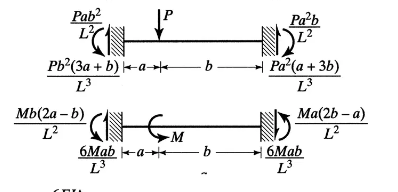
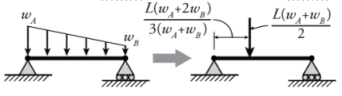

# 3D Member Element
#### Displacment and Force Vector:
The Degrees of freedom of the vectors is ordered by this order:
* $d_{xi}$: Translation in the X direction for the first node.
* $d_{yi}$: Translation in the Y direction for the first node.
* $d_{zi}$: Translation in the Z direction for the first node.
* $r_{xi}$: Rotation about the X axis for the first node.
* $r_{yi}$: Rotation about the Y axis for the first node.
* $r_{zi}$: Rotation about the Z axis for the first node.
* $d_{xj}$: Translation in the X direction for the end node.
* $d_{yj}$: Translation in the Y direction for the end node.
* $d_{zj}$: Translation in the Z direction for the end node.
* $r_{xj}$: Rotation about the X axis for the end node.
* $r_{yj}$: Rotation about the Y axis for the end node.
* $r_{zj}$: Rotation about the Z axis for the end node.

#### Material and geometry properties:
* E = The modulus of elasticity of the element.
* G = The shear modulus of the element.
* A =  The cross-sectional area.
* L = The length of the beam.
* Iy = The y-axis moment of inertia.
* Iz = The z-axis moment of inertia.
* J = The torsional constant.
#### The local stiffness matrix for every member is:
$$k = 
\left(\begin{array}{cc} 
EA \over L & 0 & 0 & 0 & 0 & 0 & -{EA \over L}& 0 & 0 & 0 & 0 & 0\\
0 & 12Elz \over L^3 & 0 & 0 & 0 & 6Elz \over L^2 & 0 & -{12Elz \over L^3} & 0 & 0 & 0 & 6EIz \over L^2\\
0 & 0 & 12EIy \over L^3 & 0 & -{6EIy \over L^2} & 0 & 0 & 0 & -{12EIy \over L^3} & 0 & -{6EIy \over L^2} & 0\\
0 & 0 & 0 & GJ \over L & 0 & 0 & 0 & 0 & 0 & -{GJ \over L} & 0 & 0\\
0 & 0 & -{6EIy \over L^2} & 0 & 4Ely \over L & 0 & 0 & 0 & 6EIy \over L^2 & 0 & 2Ely \over L & 0\\
0 & 6Elz \over L^2 & 0 & 0 & 0 & 4Elz \over L & 0 & -{6EIz \over L^2} & 0 & 0 & 0 & 2Elz \over L\\
-{EA \over L} & 0 & 0 & 0 & 0 & 0 & EA \over L & 0 & 0 & 0 & 0 & 0\\
0 & -{12Elz \over L^3} & 0 & 0 & 0 & -{6Elz \over L^2} & 0 & 12Elz \over L^3 & 0 & 0 & 0 & -{6Elz \over L^2}\\
0 & 0 & -{12Ely \over L^3} & 0 & 6EIy \over L^2 & 0 & 0 & 0 & 12Ely \over L^3 & 0 & 6Ely \over L^2 & 0\\
0 & 0 & 0 & -{GJ \over L} & 0 & 0 & 0 & 0 & 0 & GJ \over L & 0 & 0\\
0 & 0 & -{6EIy \over L^2} & 0 & 2Ely \over L & 0 & 0 & 0 & 6EIy \over L^2 & 0 & 4EIy \over L & 0\\
0 & 6Elz \over L^2 & 0 & 0 & 0 & 2Elz \over L & 0 & -{6EIz \over L^2} & 0 & 0 & 0 & 4EIz \over L\\
\end{array}\right)
$$ 

#### The transformation matrix:
The transformation matrix is needed to transform between the local and global axis of the member.
The shape of the matrix is 12X12. to find the matrix we first must find the direction cosine vector of the member vector:

This are the cosines of the angles the vector forms with the coordinate axes.
$ T_{x} = ( cos\alpha = {v_{x} \over || \vec{v} ||},cos\beta = {v_{y} \over || \vec{v} ||}, cos\theta = {v_{z} \over || \vec{v} ||}) $
To find the $ T_{z}$, we must find the the projection of the member on global XZ plane $ proj_{z}$.
$proj_{z} = (v_{x},0,v_{z})$

Then when we cross product the $proj_{z}$ with $T_{x}$ we will get the $T_{z}$, now then easily we can get  $T_{y}$ by cross product the $T_{x}$ with $T_{y}$.
Now, relatively to the order of the DOF, we build the matrix: 
$$T =
\left(\begin{array}{cc} 
T_{x1} & T_{x2} & T_{x3} & 0 & 0 & 0 & 0 & 0 & 0 & 0 & 0 & 0\\
T_{y1} & T_{y2} & T_{y3} & 0 & 0 & 0 & 0 & 0 & 0 & 0 & 0 & 0\\
T_{z1} & T_{z2} & T_{z3} & 0 & 0 & 0 & 0 & 0 & 0 & 0 & 0 & 0\\
0 & 0 & 0 & T_{x1} & T_{x2} & T_{x3} & 0 & 0 & 0 & 0 & 0 & 0\\
0 & 0 & 0 & T_{y1} & T_{y2} & T_{y3} & 0 & 0 & 0 & 0 & 0 & 0\\
0 & 0 & 0 & T_{z1} & T_{z2} & T_{z3} & 0 & 0 & 0 & 0 & 0 & 0\\
0 & 0 & 0 & 0 & 0 & 0 & T_{x1} & T_{x2} & T_{x3} & 0 & 0 & 0\\
0 & 0 & 0 & 0 & 0 & 0 & T_{y1} & T_{y2} & T_{y3} & 0 & 0 & 0\\
0 & 0 & 0 & 0 & 0 & 0 & T_{z1} & T_{z2} & T_{z3} & 0 & 0 & 0\\
0 & 0 & 0 & 0 & 0 & 0 & 0 & 0 & 0 & T_{x1} & T_{x2} & T_{x3}\\
0 & 0 & 0 & 0 & 0 & 0 & 0 & 0 & 0 & T_{y1} & T_{y2} & T_{y3}\\
0 & 0 & 0 & 0 & 0 & 0 & 0 & 0 & 0 & T_{z1} & T_{z2} & T_{z3}\\
\end{array}\right)
$$
#### Transfer between global and local axis:
To get the local vector or matrix $L$ from global vector or matrix $G$:
$L = TG$.
So that mean this equation is also true: $G = T^{-1}L$
* This is appliable for converting local force or displacment vector to global vector.

That mean $F = T^{-1}f,f = TF $ and $U = T^{-1}u,u = TU $.

The member stiffness equations in global coordinates will be written $F = KU$.
The member stiffness equations in loval coordinates will be written $f = ku$.

where :
* $F$ is the global force vector of the element.
* $U$ is the global displacment vector of the element.
* $K$ is the global stiffness matrix of the element.
* $f$ is the local force vector of the element.
* $u$ is the local displacment vector of the element.
* $k$ is the local stiffness matrix of the element.

to get how to get global stiffness matrix form local stiffness matrix we do:  
$F = T^{-1}f \rarr KU = T^{-1}ku \rarr  KU = T^{-1}kTU \rarr  K = T^{-1}kT$
Then The equation we need is $K = T^{-1}kT$

#### fixed end reactions or support reactions:

structures are often supported or constrained at certain points. In such cases, additional reactions or forces can arise at these constrained points due to the supports.
in this case the equation $f=ku$ is turned to $f=ku+f_{er}$. where $f_{er}$ is the fixed end reaction vector.

The vector is build by iterating on every point and distributed laods.
we start with $f_{er} = (0,0,0,0,0,0,0,0,0,0,0,0)$.
For each point load we check the direction and add the result to the vector:
* Fx(local axial point load): $f_{er1} +=-{P(L-x) \over L}, f_{er7} +=-{Px \over L}$.

* Fy(load on member's local y-axis): 
$f_{er2} +=-{P(L-x)^2(L+2x) \over L^3}$,
$ f_{er6} +=-{Px(L-x)^2 \over L^2},
 f_{er8} +=-{Px^2(L+2(L-x))^2 \over L^3}, f_{er12} +={Px^2(L-x) \over L^2}$.

* Fz(load on member's local z-axis): $f_{er3} +=-{P(L-x)^2(L+2x) \over L^3}, f_{er5} +={Px(L-x)^2 \over L^2}, f_{er9} +=-{Px^2(L+2(L-x))^2 \over L^3}, f_{er11} +=-{Px^2(L-x) \over L^2}$.

* Mx(magnitude of the torque): $f_{er3} +=-{P(L-x) \over L}, f_{er10} +=-{Px \over L}$.

* My(moment on member's local y-axis):  $f_{er4} +=-{6Px(L-x) \over L^3}, f_{er5} +={P(L-x)(2x-(L-x))\over L^2}, f_{er9} +={6Px(L-x)\over L^3}, f_{er11} +={Px(2(L-x)-x) \over L^2}$.

* Mz(moment on member's local z-axis):  $f_{er2} +={6Px(L-x) \over L^3}, f_{er6} +={P(L-x)(2x-(L-x))\over L^2}, f_{er8} +=-{6Px(L-x)\over L^3}, f_{er12} +={Px(2(L-x)-x) \over L^2}$.

* FX,FY,FZ(load on member's global axis): we use the the direction cosine vectors to get the Fx,Fy,Fz. and then we add to $f_{er}$ like above.

* MX,MY,MZ(moment on member's global axis): we use the the direction cosine vectors to get the Mx,My,Mz. and then we add to $f_{er}$ like above.

where $P$ is the magnitude of the load, $L$ the length of the member, $x$ is The location of the load relative to the start of the member.

Also for each linear distributed load we convert it to point load and we check the direction and add the result to the vector just like for point loads:

