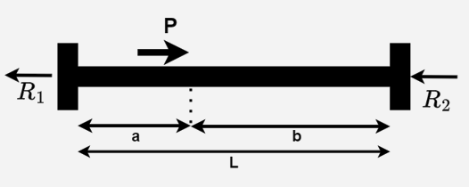
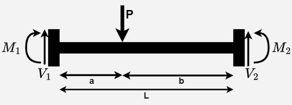
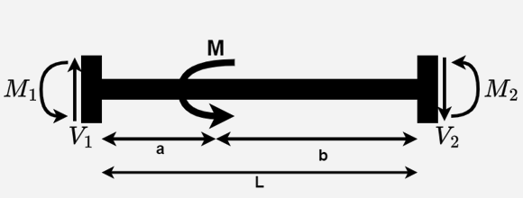
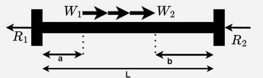
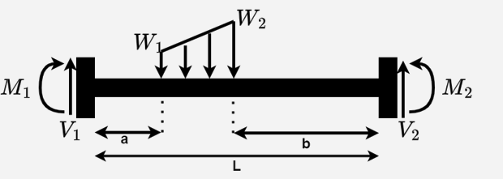

# 3D Member Element
#### Displacment and Force Vector:
The Degrees of freedom of the vectors is ordered by this order:
* $d_{xi}$: Translation in the X direction for the first node.
* $d_{yi}$: Translation in the Y direction for the first node.
* $d_{zi}$: Translation in the Z direction for the first node.
* $r_{xi}$: Rotation about the X axis for the first node.
* $r_{yi}$: Rotation about the Y axis for the first node.
* $r_{zi}$: Rotation about the Z axis for the first node.
* $d_{xj}$: Translation in the X direction for the end node.
* $d_{yj}$: Translation in the Y direction for the end node.
* $d_{zj}$: Translation in the Z direction for the end node.
* $r_{xj}$: Rotation about the X axis for the end node.
* $r_{yj}$: Rotation about the Y axis for the end node.
* $r_{zj}$: Rotation about the Z axis for the end node.

#### Material and geometry properties:
* E = The modulus of elasticity of the element.
* G = The shear modulus of the element.
* A =  The cross-sectional area.
* L = The length of the beam.
* Iy = The y-axis moment of inertia.
* Iz = The z-axis moment of inertia.
* J = The torsional constant.

#### The local stiffness matrix for every member is:
$$k = 
\left(\begin{array}{cc} 
EA \over L & 0 & 0 & 0 & 0 & 0 & -{EA \over L}& 0 & 0 & 0 & 0 & 0\\
0 & 12Elz \over L^3 & 0 & 0 & 0 & 6Elz \over L^2 & 0 & -{12Elz \over L^3} & 0 & 0 & 0 & 6EIz \over L^2\\
0 & 0 & 12EIy \over L^3 & 0 & -{6EIy \over L^2} & 0 & 0 & 0 & -{12EIy \over L^3} & 0 & -{6EIy \over L^2} & 0\\
0 & 0 & 0 & GJ \over L & 0 & 0 & 0 & 0 & 0 & -{GJ \over L} & 0 & 0\\
0 & 0 & -{6EIy \over L^2} & 0 & 4Ely \over L & 0 & 0 & 0 & 6EIy \over L^2 & 0 & 2Ely \over L & 0\\
0 & 6Elz \over L^2 & 0 & 0 & 0 & 4Elz \over L & 0 & -{6EIz \over L^2} & 0 & 0 & 0 & 2Elz \over L\\
-{EA \over L} & 0 & 0 & 0 & 0 & 0 & EA \over L & 0 & 0 & 0 & 0 & 0\\
0 & -{12Elz \over L^3} & 0 & 0 & 0 & -{6Elz \over L^2} & 0 & 12Elz \over L^3 & 0 & 0 & 0 & -{6Elz \over L^2}\\
0 & 0 & -{12Ely \over L^3} & 0 & 6EIy \over L^2 & 0 & 0 & 0 & 12Ely \over L^3 & 0 & 6Ely \over L^2 & 0\\
0 & 0 & 0 & -{GJ \over L} & 0 & 0 & 0 & 0 & 0 & GJ \over L & 0 & 0\\
0 & 0 & -{6EIy \over L^2} & 0 & 2Ely \over L & 0 & 0 & 0 & 6EIy \over L^2 & 0 & 4EIy \over L & 0\\
0 & 6Elz \over L^2 & 0 & 0 & 0 & 2Elz \over L & 0 & -{6EIz \over L^2} & 0 & 0 & 0 & 4EIz \over L\\
\end{array}\right)
$$ 

#### The transformation matrix:
The transformation matrix is needed to transform between the local and global axis of the member.
The shape of the matrix is 12X12. to find the matrix we first must find the direction cosine vector of the member vector:

This are the cosines of the angles the vector forms with the coordinate axes.
$T_{x} = ( cos\alpha = {v_{x} \over || \vec{v} ||},cos\beta = {v_{y} \over || \vec{v} ||}, cos\theta = {v_{z} \over || \vec{v} ||})$
To find the $T_{z}$, we must find the the projection of the member on global XZ plane $proj_{z}$.
$proj_{z} = (v_{x},0,v_{z})$

Then when we cross product the $proj_{z}$ with $T_{x}$ we will get the $T_{z}$, now then easily we can get  $T_{y}$ by cross product the $T_{x}$ with $T_{y}$.
Now, relatively to the order of the DOF, we build the matrix: 

$$T =
\left(\begin{array}{cc} 
T_{x1} & T_{x2} & T_{x3} & 0 & 0 & 0 & 0 & 0 & 0 & 0 & 0 & 0\\
T_{y1} & T_{y2} & T_{y3} & 0 & 0 & 0 & 0 & 0 & 0 & 0 & 0 & 0\\
T_{z1} & T_{z2} & T_{z3} & 0 & 0 & 0 & 0 & 0 & 0 & 0 & 0 & 0\\
0 & 0 & 0 & T_{x1} & T_{x2} & T_{x3} & 0 & 0 & 0 & 0 & 0 & 0\\
0 & 0 & 0 & T_{y1} & T_{y2} & T_{y3} & 0 & 0 & 0 & 0 & 0 & 0\\
0 & 0 & 0 & T_{z1} & T_{z2} & T_{z3} & 0 & 0 & 0 & 0 & 0 & 0\\
0 & 0 & 0 & 0 & 0 & 0 & T_{x1} & T_{x2} & T_{x3} & 0 & 0 & 0\\
0 & 0 & 0 & 0 & 0 & 0 & T_{y1} & T_{y2} & T_{y3} & 0 & 0 & 0\\
0 & 0 & 0 & 0 & 0 & 0 & T_{z1} & T_{z2} & T_{z3} & 0 & 0 & 0\\
0 & 0 & 0 & 0 & 0 & 0 & 0 & 0 & 0 & T_{x1} & T_{x2} & T_{x3}\\
0 & 0 & 0 & 0 & 0 & 0 & 0 & 0 & 0 & T_{y1} & T_{y2} & T_{y3}\\
0 & 0 & 0 & 0 & 0 & 0 & 0 & 0 & 0 & T_{z1} & T_{z2} & T_{z3}\\
\end{array}\right)
$$
#### Transfer between global and local axis:
To get the local vector or matrix $L$ from global vector or matrix $G$:
$L = TG$.
So that mean this equation is also true: $G = T^{-1}L$
* This is appliable for converting local force or displacment vector to global vector.

That mean $F = T^{-1}f,f = TF$ and $U = T^{-1}u,u = TU$.

The member stiffness equations in global coordinates will be written $F = KU$.
The member stiffness equations in loval coordinates will be written $f = ku$.

where :
* $F$ is the global force vector of the element.
* $U$ is the global displacment vector of the element.
* $K$ is the global stiffness matrix of the element.
* $f$ is the local force vector of the element.
* $u$ is the local displacment vector of the element.
* $k$ is the local stiffness matrix of the element.

to get how to get global stiffness matrix form local stiffness matrix we do:  
$F = T^{-1}f ⟶ KU = T^{-1}ku ⟶  KU = T^{-1}kTU ⟶  K = T^{-1}kT$
Then The equation we need is $K = T^{-1}kT$

#### fixed end reactions Vector:

The fixed end reactions vector $f_{er}$ is build by iterating on every point and distributed loads.
* We calculate the reactions of the element as if it is fixed at both ends(We explain below how to handle elements with diffrent supports).

We start with $f_{er} = (0,0,0,0,0,0,0,0,0,0,0,0)$.
For each load type we check the direction and add the result to the vector:
(You will notice a difference in Y-axis and Z-axis as the sign convention is diffrent)

* Fx(local axial point load): $R_{1}=-{Pb \over L}, R_{2} =-{Pa \over L}$. 
add them to $f_{er1},f_{er7}$

* $V_{1} =-{Pb^2(3a+b) \over L^3}$
* $V_{2} =-{Pa^2(a+3b) \over L^3}$
* $M_{1} ={Pab^2 \over L^2}$
* $M_{2} ={Pa^2b \over L^2}$
* Fy(load on member's local y-axis): 
$f_{er2} +=V_{1}$,
$f_{er6} -=M_{1}$,
$f_{er8} +=V_{2}$,
$f_{er12} +=M_{2}$.

* Fz(load on member's local z-axis):
$f_{er3} +=V_{1}$,
$f_{er5} +=M_{1}$,
$f_{er9} +=V_{2}$,
$f_{er11} -=M_{2}$.

* $V_{1} ={6Mab \over L^3}$
* $V_{2} ={6Mab \over L^3}$
* $M_{1} ={Mb(2a-b) \over L^2}$
* $M_{2} ={Ma(2b-a) \over L^2}$

* Mx(magnitude of the torque): $M_{1}=-{Mb \over L}, M_{2} =-{Ma \over L}$. 
add them to $f_{er4},f_{er10}$

* My(moment on member's local y-axis):
$f_{er3} -=V_{1}$,
$f_{er5} +=M_{1}$,
$f_{er9} +=V_{2}$,
$f_{er11} +=M_{2}$.

* Mz(moment on member's local z-axis):
$f_{er2} +=V_{1}$,
$f_{er6} +=M_{1}$,
$f_{er8} -=V_{2}$,
$f_{er12} +=M_{2}$.

* Fx(local axial distributed load): 
$R_{1}=-{(x_{2}-x_{1})(3Lw_{1}+3Lw_{2} - 2w_{1}x_{1} - 2w_{2}x_{2} - w_{2}x_{1}- w_{1}x_{2}) \over 6L}$, 
$R_{2} =-{(x_{2}-x_{1})(2w_{1}x_{1} + 2w_{2}x_{2} + w_{2}x_{1} + w_{1}x_{2}) \over 6L}$. 
add them to $f_{er1},f_{er7}$

* $V_{1} ={L_{w}w_{m} - V_{2}}$
* $V_{2} ={L_{w}(s_{1}w_{m}+s_{2}w_{d}) \over 20L^3}$
* $M_{1} =({M_{2} + V_{2}L - aL_{w}w_{m} - {L^2_{w}(2w_{2}+w_{1}) \over 6}})$
* $M_{2} =-{L_{w}(s_{3}w_{m}+s_{4}w_{d}) \over 120L^2}$
* added the same as for point load

Where:
* $L_{w} = L - a - b$
* $w_{m} = {w_{1}+w_{2}\over 2}$
* $w_{d} = {w_{2}-w_{1}}$
* $s_{1} = 10[(L^2+a^2)(L+a) - (a^2+b^2)(a-b) - Lb(L+b) - a^3]$
* $s_{2} = L_{w}[L(2L+a+b) - 3(a-b)^2 - 2ab]$
* $s_{3} = 120ab(a+L_{w}) + 10L_{w}(6a^2 + 4LL_{w} - 3L_{w}^200)$
* $s_{4} = 10LL_{w}^2 - 10L_{w}a(L-3b)-9L_{w}^3$
--------------------------------
* FX,FY,FZ(load on member's global axis): we use the the direction cosine vectors to get the Fx,Fy,Fz. and then we add to $f_{er}$ like above.

* MX,MY,MZ(moment on member's global axis): we use the the direction cosine vectors to get the Mx,My,Mz. and then we add to $f_{er}$ like above.

#### Local end forces vector(after analysis)

structures are supported or constrained at certain points. In such cases, additional reactions or forces can arise at these constrained points due to the supports.

where we repersent the vector that contain only the reactions of the element as $f_{er}$.

* The external force vector is $f_{ext}=ku$.
* The internal force vector is $f = f_{ext} + f_{er}$.
* We find the internal shear and moment from the vector $f$.

where $u$ is the displacment vector that found from the global analysis.
##### how to find reactions for elements with different supports:
* If the element is fixed in both ends, then the $u$ vector is all zeros, then $f = f_{er}$.
* If the element have different supports, then the $u$ vector is not zero where the degree of freedom is free, That's mean that $f_{ext}$ vector is not zero.
* So if the element has pinned support for example you will get it from fixed end reaction + the external forces you get from the stiffness matrix and the displacment vector.

#### Beam Segment Equations(after analysis)
Loading along a beam is not always mathematically continuous. Concentrated forces and moments, as well as starting and ending points of distributed loads interupt the mathematical continuity of the beam. For this reason, it is convenient to segment the beam between discontinuities to form a series of mathematically continuous segments. This allows for the direct calculation of maximum/minimum forces, rotations, and deflections in each segment.

Every segment is partitioned to segZ for bending about local z-axis, segY for bending about local y-axis, segX for torsional moment.
Note that mean that segZ is viewed in XY axis, SegY in XZ axis.

##### Linear Distributed Load Equation
The equation for a linear distributed load is expressed as follows:
$w_{x} = w_{1} + {{w_{2} - w_{1}}\over L} x$
Where:
* $w_{1}$ is the magnitude of distributed load at starting point.
* $w_{2}$ is the magnitude of distributed load at ending point.
* $L$ is the Length of the segment.

We will use this for the other equations, of course if there is no distributed load Then the value is fixed along the segment.

##### Shear Force Equation
The change in the shear force is equal to the area under (or integral of) the load diagram. If the shear force at the start of the segment, $V_{1}$, is known, the shear force at any point $x$, relative to the start of the segment can be expressed as:
$V_{x} = V_{1} + \int_0^x w_{x}dx$ 
* $V_{1} = f_{2} + \sum_{i=1}^{Py} Py_{i} + \sum_{i=1}^{Dy} Dy_{i}$ plus for segZ 
and $V_{1} = f_{3} + \sum_{i=1}^{Pz} Pz_{i}+ \sum_{i=1}^{Dz} Dz_{i}$ for segY.
* Where $f$ is the local end force vector.
* Where $Py$ is the vector of all the point loads in the local Y direction on the element where the location $x$ of the point load is smaller or equal to $x$.
* Where $Pz$ is the vector of all the point loads in the local Z direction on the element where the location $x$ of the point load is smaller or equal to $x$.
* Where $Dy$ is the vector of all the distributed shear loads in the local Y direction on the element where the start location $x$ of the segment is after or inside the distributed load.
* Where $Dz$ is the vector of all the distributed shear loads in the local Z direction on the element where the start location $x$ of the segment is after or inside the distributed load.
* The shear of each distributed load in $Dy$ and $Dz$ is ${(w_{1} + w_{2}) \over 2} * (x_{2} - x_{1})$.
($w_{2}$ and $x_{2}$ is modified if the start of the segment is inside the distributed load)

##### Moment Equation
Similarly, the change in the moment diagram is equal to the area under the shear diagram. If the moment at the start of the segment, $M_{1}$ is known, the moment at any point, relative to the start of the segment can be expressed as:
$M_{x} = M_{1} - \int_0^x V_{x}dx$ for segZ.
$M_{x} = -M_{1} - \int_0^x V_{x}dx$ for segY.
* $M_{1} = f_{6} - f_{2}x - \sum_{i=1}^{Py} Py_{i} + \sum_{i=1}^{Mz} Mz_{i}- \sum_{i=1}^{Dy} Dy_{i}$ for segZ.
* $M_{1} = f_{5} + f_{3}x + \sum_{i=1}^{Pz} Pz_{i} + \sum_{i=1}^{My} My_{i}+ \sum_{i=1}^{Dz} Dz_{i}$ for segY.
* $f_{2}x$ and $f_{3}x$ is moment as distanced from $x_{1}$ by x.
* Where $Mz$ is the vector of all the moment loads in the local Z direction on the element where the location $x$ of the Moment load is smaller or equal to $x$.
* Where $My$ is the vector of all the moment loads in the local Y direction on the element where the location $x$ of the Moment load is smaller or equal to $x$.
* Where $Dy$ is the vector of all the distributed moment loads in the local Y direction on the element where the start location $x$ of the segment is after or inside the distributed load.
* Where $Dz$ is the vector of all the distributed moment loads in the local Z direction on the element where the start location $x$ of the segment is after or inside the distributed load.
* The moment of each distributed load in $Dy$ and $Dz$ is
 $(x_{1} - x_{2}) * {2w_{1}x_{1} - 3w_{1}x + w_{1}x_{2} + w_{2}x_{1} - 3w_{2}x + 2w_{2}x_{2} \over 6}$.
($w_{2}$ and $x_{2}$ is modified if the start of the segment is inside the distributed load)

##### Slope Equation
The slope of the elastic curve $\theta$, can be obtained by integrating the moment diagram and dividing by the flexural rigidity $EL$.
$\theta_{x} = \theta_{1} - {1\over EI}\int_0^x M_{x}$ for segZ.
$\theta_{x} = \theta_{1} + {1\over EI}\int_0^x M_{x}$ for segY.

* $\theta_{1} = {1 \over 3}({(f_{6} - F_{er6})L \over EIz} - {(f_{12} - F_{er12})L \over 2EIz} + {3(d_{yj}-d_{yi})\over L})$ for segZ.
* $\theta_{1} = -{1 \over 3}({-(f_{5} - F_{er5})L \over EIy} - {-(f_{11} - F_{er11})L \over 2EIy} + {3(d_{zj}-d_{zi})\over L})$ for segY.
(The traditional slope-deflection equations assume a sign convention opposite of what we uses for moments about the local y-axis, so a negative value has been applied to those values specifically.)

This equations derived from slope-deflection equations:
$M_{i} = {2EI \over L}(2\theta_{1} + \theta_{2} - 3\varphi) + FEM_{i}$.
$M_{j} = {2EI \over L}(\theta_{1} + 2\theta_{2} - 3\varphi) + FEM_{j}$.
Where:
* $M_{i},M_{j}$ end moment for each node i,j.
* $FEM_{i},FEM_{j}$ fixed end moment for each node i,j.
* $\varphi = {(d_{j}-d_{i})\over L}$ is the chord rotation.

##### Deflection Equation
Integrating one more time gives us the equation for the deflection along the segment.
$\delta_{x} = \delta_{1} + \int_0^x \theta_{x}$ for segZ.
$\delta_{x} = \delta_{1} - \int_0^x \theta_{x}$ for segY.
* $\delta_{1} = d_{yi}$ is Deflection at the start of the segZ.
* $\delta_{1} = d_{zi}$ is Deflection at the start of the segY.
